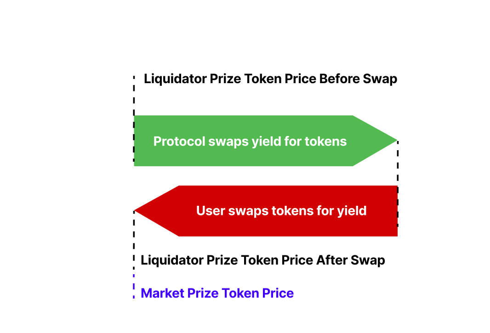
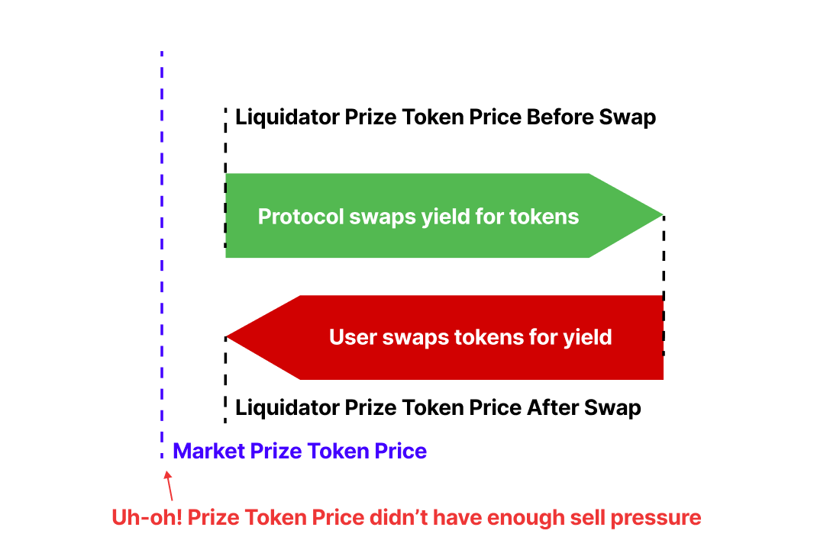
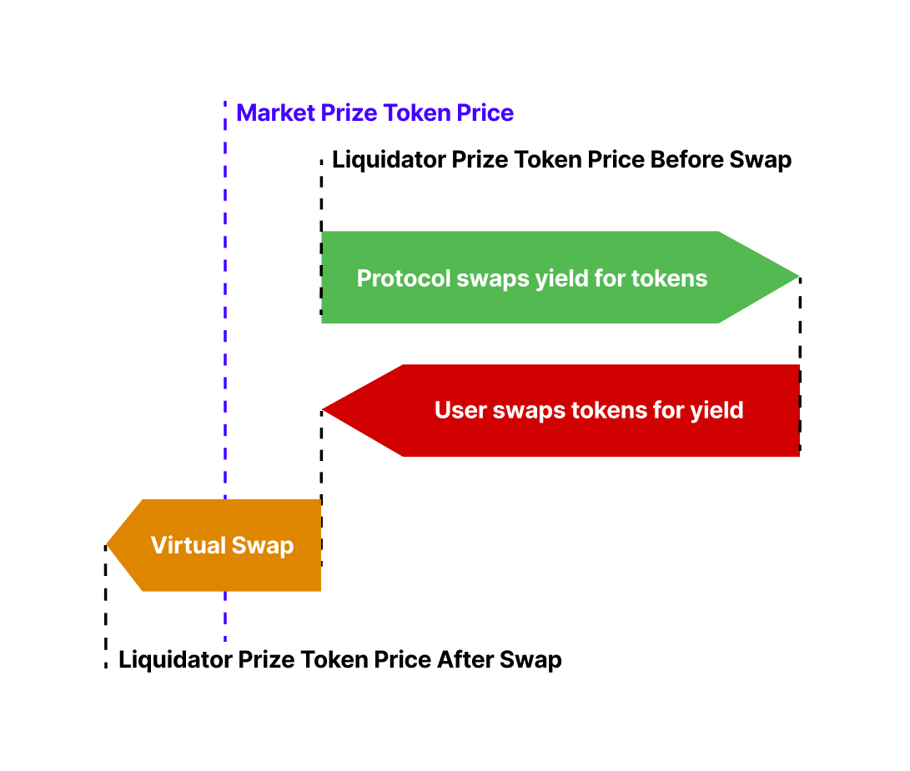
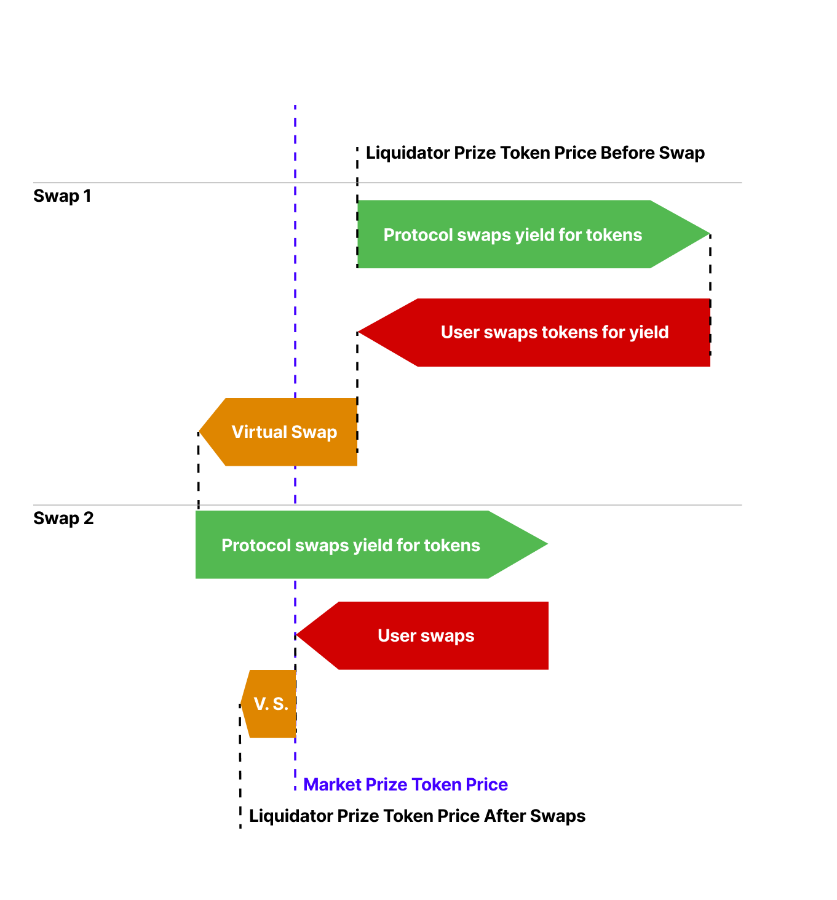

# PoolTogether Liquidator Simulation

This JavaScript project simulates the PoolTogether Liquidator algorithm.

# Usage

If you fork this package you can simply run `src/index.js`.  Otherwise if you install it as an npm package, you can use the `lsim` command.

```
Usage: lsim [options]

simulates the PoolTogether liquidation algorithm

Options:
  -d, --duration <number>            The number of time units to run for (default: 1000)
  -a, --ema-alpha <number>           adjust how “reactive” the yield moving average is. Higher alpha means more
                                     weighting on recent values. Low alpha means broader, more smoothed average
                                     (default: 0.7)
  -s, --swap-multiplier <number>     This determines how quickly the price tracks downward market swings. Higher values
                                     also mean that more yield is left unsold, due to price impact. (default: 0.3)
  -l, --liquidity-fraction <number>  Determines the size of virtual LP to the average yield. Lower values make for
                                     efficient swaps, but it will track downward price swings poorly. (default: 0.02)
  -o, --output-csv <path>            outputs a csv file
  -h, --help                         display help for command
```

# Yield Liquidation Algorithm

The PoolTogether [Prize Pool Network](https://gov.pooltogether.com/t/the-prize-pool-network/2312) will require the protocol to sell yield. The protocol will be liquidating the yield for the prize token, whichever token that might be. In this way, interest from potentially thousands of types of tokens is consolidated into a single token for prize liquidity.

To maximize the return from liquidations we need to:

- Sell all of the available yield
- Sell the yield at the highest rate possible

A secondary goal is to on-board new assets rapidly, so we need the ability to liquidate any kind of token. This means that:

- The code should not rely on oracles, as they have a limited set of assets
- The code should not rely on external protocols. We need to move quickly to new chains
- The code should be autonomous, as we won't be able to manually track hundreds of assets.

We've developed a liquidation algorithm that meets all of the requirements above, and the details of which will follow in a separate post.

## Swaps

Let's reframe yield liquidation in terms of swaps. These are the two sides to the swap:

- The protocol is swapping yield for prize tokens (protocol wants prize tokens)
- Users are swapping prize tokens for yield (users want to arbitrage yield)

When you swap with an AMM, you are shifting token liquidity. A swap adds tokens to one side and removes tokens from the other:

- Swapping yield tokens for prize tokens: adds yield tokens, removes prize tokens
- Swapping prize tokens for yield tokens: adds prize tokens, removes yield tokens

By swapping yield tokens for prize tokens we increase the yield liquidity and decrease the prize token liquidity. There is now more yield token per prize token in the pair, so the *buying power of prize tokens has increased*. Vice versa for the other side of the swap. This is how price changes occur in an AMM.

This behaviour is useful to us; as the protocol swaps yield for prizes the buying power of the prize tokens increases. The value of the prize tokens will exceed the going market rate, and it will become an arbitrage opportunity.

When users swap tokens for yield, they will arbitrage any difference, and so the pair will re-balance to the market rate.

# Virtual Liquidity

In an AMM the liquidity of the pair is held by the contract itself: each Uniswap pair holds tokens. However, our swapping mechanism won't hold liquidity directly, because:

- Yield accrues gradually in the prize pools
- Tokens are sent to the prize distributor

Instead, we'll need to create "virtual" liquidity; when we create the liquidation pair we'll configure virtual liquidity amounts for both the yield tokens and prize tokens.

For AMM pairs the size of the liquidity determines the price "slippage" for trades, so we'll want the virtual liquidity amounts to be appropriate for the rate of accrual of yield. More on this later....

# Protocol: Swaps Yield for Tokens

The protocol is going to swap yield for tokens. However, there are some important considerations:

- The protocol swap won't actually transfer tokens, because the protocol already owns the liquidity. The swap will be purely virtual.
- Yield accrues passively. When is the swap executed?

We can execute the virtual swap when a user swaps tokens for yield. As long as the virtual swap occurs before the user swap is calculated, then there will be an arbitrage opportunity.

# User: Swaps Tokens for Yield

We've now established that when a user swaps tokens for yield, these two steps occur:

1. We do a virtual swap of yield for tokens
2. We execute a real swap of tokens for yield (yay arbitrage!)

Great! Next let's make some observations:

- A rational user will swap only enough to capture the discount from the market rate.
- A user cannot swap more than the available yield.

With these in mind, let's analyze market conditions with respect to the value of tokens.

# Swaps Under Market Conditions

The market condition is the difference between the token price on the liquidator and the token price on the market.

For example: if the yield tokens are USDC and the prize tokens are POOL, then the liquidator price of tokens will be USDC per POOL. This price may or may not differ from the current market price of POOL.

There are three market conditions we will consider:

1. When the market price of prize tokens is the same as the liquidator price
2. When the market price of prize tokens is higher than the liquidator price
3. When the market price of prize tokens is lower than the liquidator price

## Market Price Matches Liquidator Price

When the exchange rate on the liquidator matches the market the user will arbitrage the entire yield. The exchange rate after the swap remains the same, because the user consumed the entire yield.



## Market Price is Higher

In this scenario the market is trading the prize tokens at a higher price than the liquidator. Remember our earlier observation: a rational user will only capture the above market rate for tokens. Users will only arbitrage up until the market rate:


## Market Price is Lower

In this scenario the market price of tokens is *lower* than the liquidator price. The user will want to swap as much as possible, because the tokens have greater buying power in the liquidator.

***The problem is that users cannot purchase more than the available yield.***

We will see the same behaviour as a stable market price:



# Virtual Swap Multiplier

We need to add additional swap pressure so that the token value can *decrease*.

To do this, we can add an additional virtual swap to every user swap. This virtual swap is a fraction of the user swap; so when a user swaps it will drive the price down further. This fraction is the swap multiplier. The virtual swap occurs after a user swap, and will be a percent of the user swap size.  It does not affect the user swap.



As a consequence, however, it means less of the yield can be arbitraged:



A balance needs to be struck between the ability to track the market rate and maximizing the amount of yield liquidated.

# Adaptive Virtual Liquidity

The size of the virtual liquidity determines the efficiency of trades in either direction.

If the virtual liquidity is small relative to the yield then:

- Yield accrual will have a larger affect on the exchange rate: price goes up faster
- More slippage is incurred from arbitrage: price goes down faster

If the virtual liquidity is large, then the opposite is true.

A prize pool's yield will change over time, so we need the virtual liquidity amount to adapt to the amount of yield so that trades are efficient.

**An Adaptive Approach**

Let's say we want the yield to always be 5% of the virtual liquidity. After each swap, we adjust the virtual liquidity like so:

```
liquidityFraction = 0.05
multiplier = currentlyAccruedYield / (yieldVirtualLiquidity*liquidityFraction)

yieldVirtualLiquidity = multiplier * yieldVirtualLiquidity
tokenVirtualLiquidity = multiplier * tokenVirtualLiquidity
```

The `liquidityFraction` determines the yield's size relative to the virtual liquidity. In this case the yield will be 5% of the virtual liquidity.

# Analysis

The simulation runs for 1000 units of time. The simulation changes the accrual rate of yield tokens over four different orders of magnitude:

```
Time 0 - 99 it accrues 10 per time unit
Time 100 - 399 it accrues 100 per time unit
Time 400 - 799 it accrues 1000 per time unit
Time 800+ it accrues 10000 per time unit
```

The market rates of the prize token also change significantly. In fact there are several points where the prize token value tanks ~30%. It's not terribly realistic but it is very illustrative.

Let's analyze the liquidator prize token price vs the market price of the prize token. When we run the liquidator simulation like so:

```
./src/index.js -a 1 -l 0.03 -o test.csv -s 0.3
```

We can chart the output and see how well the liquidator tracks the market exchange rate:


Notice how:

- When the market price rises, the liquidator easily tracks it.
- When the market price drops, the liquidator price descends linearly.
- The liquidator price is always slightly higher than the market price: this is the arbitrage opportunity.

# Summary

You can see how a virtual AMM will allow us to scale yield liquidations with very little overhead. We now have a complete swapping algorithm. When someone swaps these steps occur:

1. Protocol virtually swaps yield for tokens
2. User swaps tokens for yield
3. Extra virtual user swap (negative pressure)
4. Adjust virtual liquidity based on accrued yield

The controls we have available are:

- **Initial virtual liquidity**: This will determine the exchange rate of the pair, the efficiency of swaps, and how quickly the price will track market swings.
- **Swap Multiplier**: This determines how quickly the price tracks downward market swings. Higher values also mean that more yield is left unsold, due to price impact.
- **Liquidity fraction**: Determines the size of virtual LP to the average yield. Lower values make for efficient swaps, but it will track downward price swings poorly.

That being said, in our simulations we found stable values for the swap multiplier, and liquidity fraction. It's unlikely we'll have to adjust these.
